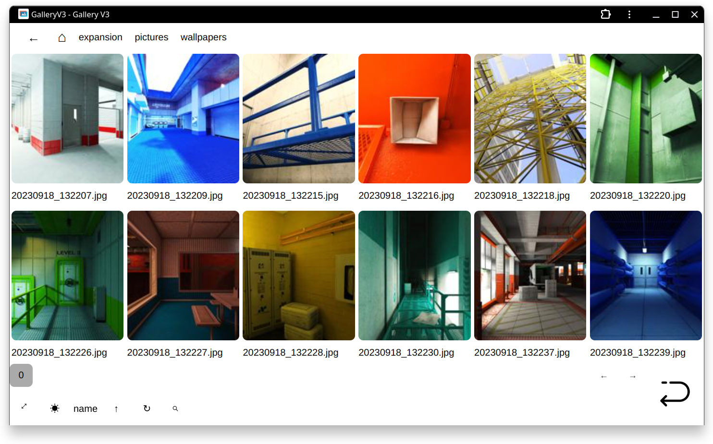

# GalleryV3
Self-hosted image/video gallery.
Supports images/gifs/videos. Optimized for mobile device.


For my personal use, hosted on my homelab.

* Extremely easy to run.
* Folder scanning and thumbnail creation are performed on demand (no background activities at all, might take a while scanning a folder for the first time).
* Can be installed as PWA (requires https, use nginx or something as reverse proxy).
* First image within a folder will be set as folder thumbnail, useful for viewing comics.
* Simple searching & sorting.
* A light mode.

## Requirement
* python3
* ffmpeg (optional, for creating video thumbnail)

```
sudo apt-get install python3 ffmpeg
```

* flask
* natsort
* PIL

```
pip install flask natsort pillow
```

## Run
1. edit `config.py`, 
change base folder, port and base url.

2. run `python3 server.py`
3. visit http://127.0.0.1:5000/gv3

### In viewer:

<kbd>PgUp</kbd> previous image/video;

<kbd>PgDn</kbd> next image/video;

<kbd>←</kbd> <kbd>→</kbd> video position control;

<kbd>Space</kbd> video pause/continue;

<kbd>↑</kbd> <kbd>↓</kbd> video sound volumn control;

With touchscreen, pinch to zoom in and out ( it's quite janky though, still working on it).

## Screenshots


Light mode:


