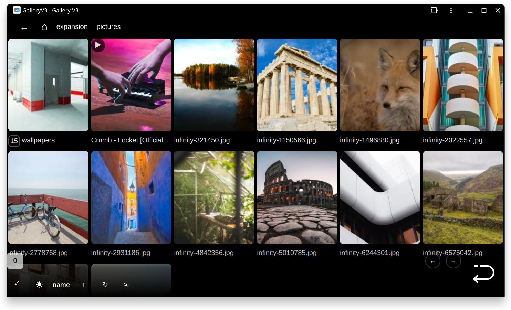

# GalleryV3
Self-hosted image/video gallery.
Supports images/gifs/videos. Optimized for mobile device.
Folder scans and thumbnails cache are created on demand.

For my personal use, hosted on linux.

Also, PWA supported.

## Requirement
* python3
* flask
* natsort
* ffmpeg (optional, for creating video thumbnail)

## Run
1. edit `config.py`

Change base folder, port and base url.

2. run `python3 server.py`
3. visit http://127.0.0.1:5000/gv3

## Screenshots

Quick Control:

